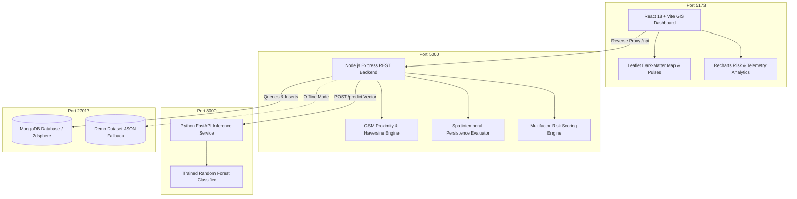

# 🛰️ SAT-THERM INTELLIGENCE
### Satellite Thermal Source Monitoring & Multi-Sensor Thermal Anomaly Analysis Pipeline

[](https://www.python.org/)
[](https://fastapi.tiangolo.com/)
[](https://leafletjs.com/)
[](https://www.sqlalchemy.org/)
[]()
[]()

---

## 📌 Executive Summary

Raw satellite thermal anomaly datasets (such as **NASA FIRMS VIIRS & MODIS**) detect surface high-temperature hotspots across the globe. However, raw thermal detections do not indicate **what caused the heat**. A refinery gas flare, an active blast furnace, stubble burning in agricultural fields, and a forest wildfire can all register similar Fire Radiative Power (FRP) and brightness temperatures.

**SAT-THERM INTELLIGENCE** is an end-to-end automated pipeline that contextualizes, classifies, and tracks satellite thermal anomalies in real time by fusing:
1. **Multi-Sensor Satellite Telemetry** (NASA FIRMS VIIRS 375m & MODIS 1km)
2. **OpenStreetMap (OSM) Industrial Proximity Intelligence** (Refineries, Gas Flares, Steel Mills, Thermal Power Plants, Chemical complexes)
3. **Biophysical Land-Cover Context** (ESA WorldCover biome & vegetation density)
4. **Machine Learning Feature Engineering** (Standardized 13-dimensional feature vectors ready for ML inference)
5. **Spatiotemporal DBSCAN Clustering & Persistence Scoring** (Distinguishing transient fires from permanent industrial operations)
6. **Command-and-Control Geospatial Dashboard** (Interactive dark-matter/satellite GIS mapping, analytics, and instant GeoJSON/CSV export)

---

## 🏗️ Multi-Tier Architecture & Pipeline Flow



---

## 🔍 Core Innovation & Features

### 1. Multi-Layer Context Enrichment
Every thermal detection is enriched in real time:
- **OSM Industrial Reverse Search**: Exact Haversine distance and facility metadata for industrial assets within a 3,000-meter radius (with offline spatial caching).
- **Land-Cover & Biome Context**: Distinguishes industrial complexes from agricultural fields and forested canopies.
- **Solar Day/Night Differential**: Distinguishes solar-reflective false positives from genuine night-time combustion (False Alarm Reduction).

### 2. Multi-Class Random Forest Characterization
Events are categorized into five environmental and industrial classes via a trained Scikit-Learn Random Forest model:
- **🔥 Gas Flare**: High night-time brightness temperature, proximity (<800m) to oil/gas refineries, flaring stacks, and high temporal persistence.
- **🚨 Potential Industrial Fire**: Acute high thermal intensity (FRP > 40 MW), near industrial facilities with low prior persistence.
- **🏭 Normal / Persistent Industrial Heat Source**: Proximity to steel plants, thermal power stations, cement kilns, or manufacturing zones with multi-day detections.
- **🌾 Agricultural Burning**: Detections over agricultural land, daytime predominance, low proximity to industry, and seasonal pulse dynamics.
- **🌲 Other Thermal Source**: Remote forest fires, low-confidence anomalies, or transient heat signatures.

### 3. Spatiotemporal Persistence Engine
Industrial facilities emit thermal anomalies continuously over weeks and months, whereas agricultural residue and wildfires extinguish within hours to days.
- **Clustering**: Groups hotspots within 1,000m across temporal observation windows.
- **Quantitative Tracking**: Computes detection counts, persistence duration in hours, and observation frequency.

### 4. Transparent 0–100 Risk Scoring
Combines thermal intensity, sensor confidence, proximity to critical infrastructure, persistence duration, and acute abnormality into a weighted risk score.

---

## 📡 REST API Reference

### Express Backend API (Port 5000)

| Method | Endpoint | Description |
|---|---|---|
| `GET` | `/api/health` | Complete system health: MongoDB status, ML microservice status, data provider mode |
| `GET` | `/api/config` | System configuration, spatial tolerance parameters, risk scoring thresholds |
| `GET` | `/api/hotspots` | Filter hotspots by risk level, classification, persistence, dates, and search terms |
| `GET` | `/api/hotspots/:id` | Detailed record for a single hotspot |
| `POST`| `/api/hotspots` | Ingest a new hotspot observation |
| `GET` | `/api/hotspots/history` | Historical timeline aggregations grouped by date |
| `GET` | `/api/hotspots/nearby` | Spatial radius search (`latitude`, `longitude`, `radiusKm`) |
| `GET` | `/api/statistics` | Dashboard analytics: classification breakdown, risk distribution, timeline series |
| `POST`| `/api/analyze` | Full end-to-end pipeline: Telemetry -> OSM -> Persistence -> ML Predict -> Risk Score -> MongoDB |

### Python FastAPI ML Microservice (Port 8000)

| Method | Endpoint | Description |
|---|---|---|
| `GET` | `/health` | Model status, loaded algorithm (`RandomForestClassifier`), classes, and holdout accuracy |
| `POST`| `/predict` | Ingests 10-feature vector; returns winning class, confidence score, and probability distribution |
| `GET` | `/docs` | Interactive Swagger OpenAPI documentation |

---

## 🚀 Quickstart & Launching Services

### Prerequisites
- Node.js (v18 or v20+)
- Python 3.10, 3.11, or 3.12 with virtual environment in `.venv/`
- (Optional) MongoDB on port 27017 *(if not running, backend runs smoothly in demo mode)*

---

### Option A: 1-Click Launch (Recommended for Windows)

Simply double-click **`start_all.bat`** or run in PowerShell:
```powershell
.\start_all.ps1
```
This automatically launches all 3 microservices in coordinated windows.

---

### Option B: Manual Launch (3 Terminals)

**Terminal 1 — Machine Learning Microservice**:
```bash
cd ml-service
..\.venv\Scripts\python.exe -m uvicorn app:app --host 127.0.0.1 --port 8000 --reload
```

**Terminal 2 — Express REST API Backend**:
```bash
cd backend
npm start
```

**Terminal 3 — React + Vite GIS Frontend**:
```bash
cd frontend
npm run dev
```

---

### Access URLs
- 🗺️ **GIS Command Dashboard**: [http://localhost:5173](http://localhost:5173)
- 🔌 **Express REST API**: [http://localhost:5000/api/health](http://localhost:5000/api/health)
- 🧠 **FastAPI ML Swagger Docs**: [http://localhost:8000/docs](http://localhost:8000/docs)

---

## ☁️ Cloud & Production Deployment

### Option 1: Docker Compose (Unified Multi-Container Deployment)
Launch the entire stack (FastAPI ML Service + Express Backend + Nginx React Frontend + MongoDB) with a single command:
```bash
docker compose up --build -d
```
- Dashboard: [http://localhost](http://localhost) (Port 80)
- Backend API: [http://localhost:5000](http://localhost:5000)
- ML Microservice: [http://localhost:8000](http://localhost:8000)

### Option 2: Render.com 1-Click Blueprint (`render.yaml`)
1. Push this repository to GitHub.
2. Log into [Render Dashboard](https://dashboard.render.com).
3. Click **New +** -> **Blueprint**.
4. Connect this GitHub repository. Render automatically reads `render.yaml` and spins up:
   - `sat-therm-ml`: Python FastAPI Web Service
   - `sat-therm-backend`: Node.js Express REST Service
   - `sat-therm-frontend`: Vite React Static Site

### Option 3: Vercel (Frontend) + Render (Backend)
- **Frontend on Vercel**: Connect the repo on [Vercel](https://vercel.com), select Root Directory `frontend/`, and add environment variable:
  `VITE_API_URL=https://your-backend.onrender.com/api`
- **Backend on Render**: Deploy `backend/` as a Node Web Service and `ml-service/` as a Python Web Service.

---

## 🧪 Running Automated Tests

The test suite covers API integration, service logic, and boundary validation across 23 comprehensive tests:
```bash
.\.venv\Scripts\python.exe -m pytest -v
```

All 23 tests pass:
- `tests/test_api.py` (Health, mock ingestion, event listing, GeoJSON formatting, multi-layer context, statistics, cluster inspection, incident resolution, real-time fire detection simulation, severity & status filtering, telemetry analytics)
- `tests/test_services.py` (OSM reverse queries, classification heuristics, feature vector serialization, persistence clustering)
- `tests/test_validation.py` (FIRMS CSV parsing, coordinates bounds checking, confidence normalization, haversine distance, bounding box calculations)

---

## 🎯 Hackathon Demonstration Guide

When demonstrating **SAT-THERM INTELLIGENCE** to evaluators:

1. **Dashboard Overview**:
   - Open [http://localhost:5173](http://localhost:5173) to showcase the dark-matter UI with live telemetry counters across India.
   - Switch basemaps between **Dark Matter**, **Satellite Imagery (ESRI)**, and **OpenStreetMap**.
2. **Category Classification**:
   - Filter by classification chip (**Gas Flare**, **Potential Industrial Fire**, **Persistent Heat Source**, **Agricultural Burning**).
   - Observe how markers dynamically filter and display distinctive pulsing color halos.
3. **Interactive Analysis (End-to-End Pipeline)**:
   - Click the **Analyze Hotspot** button in the header.
   - Enter coordinates (e.g. Jamnagar Refinery: `22.353, 69.853` or Singrauli Thermal Plant: `24.201, 82.671`).
   - Click **Run Pipeline Analysis** to watch live telemetry dispatch through OSM enrichment, persistence scoring, FastAPI Random Forest inference, and real-time risk factor breakdown.
4. **Persistent Hotspot Tracking**:
   - Inspect the persistent clusters list (e.g. *Jamnagar Reliance Petroleum Refinery*).
   - Fly directly to the cluster centroid to display historical detection counts and duration.
5. **GIS Data Export**:
   - Click **📥 GeoJSON** to download standard geospatial datasets ready for QGIS and Mapbox.
   - Click **📊 CSV** to download tabular reports for offline analytical review.

---

## 📜 License
Developed for the **Smart India Hackathon (SIH)**. Distributed under the MIT License.

